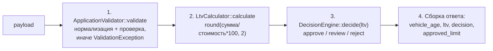

# Как считается решение approve / review / reject

Разбор по `backend/src/Domain/` и `backend/config/rules.php`. Файлы не менялись.

## Конвейер: файлы, функции, порядок

Сборка зависимостей — `backend/src/AppFactory.php:30-39`: `ApplicationValidator` получает весь справочник `$rules` + `VinValidator($rules['vin'])` + `VehicleAge(date('Y'))`, а `DecisionEngine` — только секцию `$rules['ltv']` (`approve_max: 60.0`, `review_max: 85.0` из `rules.php:43-46`).

Единственная точка входа — `AssessmentService::assess()` (`AssessmentService.php:28-42`):

1. **`ApplicationValidator::validate($payload)`** (`ApplicationValidator.php:24-83`) — нормализует и проверяет заявку целиком; ошибки собираются в массив и бросаются одной `ValidationException` (строки 71-73). Проверки: VIN через `VinValidator::isValid` (17 символов `A-Z0-9`, без `I/O/Q` — `VinValidator.php:18-37`); год ≥ `min_year` 1990, не из будущего и возраст ≤ `max_age_years` 20 (возраст считает `VehicleAge::inYears` = текущий год − год выпуска, `VehicleAge.php:18-21`); пробег 0…500 000; `market_value > 0`; сумма 50 000…2 000 000; срок 3…48 мес. При успехе возвращает нормализованный массив `{vin, year, mileage, market_value, requested_amount, term_months}`.
2. **`LtvCalculator::calculate($requestedAmount, $marketValue)`** (`LtvCalculator.php:15-26`) — LTV в процентах с 2 знаками: `round(requested / market * 100, 2)`; при неположительных аргументах бросает `InvalidArgumentException` (по факту эти случаи уже отсечены валидатором).
3. **`DecisionEngine::decide(float $ltv)`** (`DecisionEngine.php:30-41`):
   - `$ltv < 60.0` → `approve`
   - `$ltv <= 85.0` → `review`
   - иначе → `reject`

   Замечание: докблок класса (`DecisionEngine.php:10-12`) и комментарий в `rules.php:39` обещают «`LTV <= approve_max → approve`», но в коде строгое `<`. То есть LTV ровно 60.00 даёт `review`, а не `approve`. Расхождение комментария с кодом — учесть при граничных тестах.
4. **Сборка ответа** (`AssessmentService.php:35-41`) — `vehicle_age` (второй вызов `VehicleAge::inYears`), `ltv`, `decision`, `approved_limit` = `requested_amount` при `approve`, иначе 0. Справочник `ltv_by_age` (`rules.php:53-58`) кодом **не используется нигде** — `AppFactory` передаёт в `DecisionEngine` только `rules['ltv']`; комментарий относит расчёт лимита по возрасту к задаче LOAN-12.

## Куда встанет правило «пробег ≤ 400 000, иначе review»

Правило уровня **решения**, не валидации: пробег 400 001…500 000 — валидный вход (лимит валидации 500 000 из `rules.php:23`), но решение должно стать `review`.

- **Функция:** `DecisionEngine::decide()` — новая проверка рядом с цепочкой LTV-порогов, после того как LTV-решение вычислено (даунгрейд `approve` → `review` при пробеге выше порога). Альтернатива — между шагами 2 и 3 в `AssessmentService::assess()`, но по текущей архитектуре логика решения живёт в `DecisionEngine`.
- **Точка вызова:** `AssessmentService.php:33` — сейчас `$this->decisionEngine->decide($ltv)`; сюда же пробег и передавать.

**Что уже есть:**

- Валидированный `$input['mileage']` (int) — `ApplicationValidator` возвращает его (`ApplicationValidator.php:78`), и `assess()` уже имеет к нему доступ.
- Место для порога в конфиге — секция `vehicle` в `rules.php`, рядом с существующим `max_mileage_km` (конвенция проекта: бизнес-числа только из `rules.php`).
- `approved_limit` уже завязан на `decision === APPROVE` (`AssessmentService.php:39`) — даунгрейд до `review` автоматически даст лимит 0, доп. правок не нужно.

**Чего не хватает:**

- У `decide()` сигнатура `decide(float $ltv)` — параметра «пробег» нет (`DecisionEngine.php:30`).
- Конструктор `DecisionEngine` получает только `{approve_max, review_max}`; секция `vehicle` ему не передаётся (в т.ч. на сборке — `AppFactory.php:37`). Порог придётся прокинуть отдельным ключом конфига или расширить передаваемую секцию.
- Порога 400 000 в `rules.php` нет — есть только `max_mileage_km = 500000` (валидационный).
- В `tests/` пробег встречается только как валидное значение фикстур (`AssessmentServiceTest.php:38` — 96 000, `ApplicationValidatorTest.php:34` — 84 000); тестов на поведение «пробег → решение» нет.
- Требует уточнения семантика «иначе review»: даунгрейд только `approve` → `review` (при `reject` остаётся `reject`) или принудительный `review` поверх любого решения. В коде этого нет; в `docs/plan/README.md:13` как образец плана упомянуты граничные тесты 399 999 / 400 000 / 400 001, из чего следует граница «≤ 400 000 — ок».

## Что прямо сейчас проверяется про пробег

- **Единственная проверка** во всём бэкенде — `ApplicationValidator.php:43-46`: `0 ≤ mileage ≤ max_mileage_km (500 000)`, иначе `ValidationException` с текстом «Пробег от 0 до 500000 км». Отсутствующее поле даёт `-1` и тоже падает в ошибку.
- Дальше пробег **нигде не участвует**: в `LtvCalculator`, `DecisionEngine` и расчёте лимита его нет — `DecisionEngine` вообще его не видит, только LTV. Он лишь сохраняется в БД (`ApplicationRepository.php:38-45`, колонка `mileage_km`) и возвращается в ответе внутри `input`.

## План реализации (4 правки + тесты)

1. Новый ключ порога в `rules.php` (секция `vehicle`).
2. Прокидывание порога в `DecisionEngine` на сборке в `AppFactory`.
3. Параметр `int $mileage` в `decide()` с проверкой после LTV-цепочки.
4. Передача `$input['mileage']` в точке вызова `AssessmentService.php:33`.
5. Граничные тесты 399 999 / 400 000 / 400 001 и проверка, что `approved_limit` при даунгрейде стал 0.
